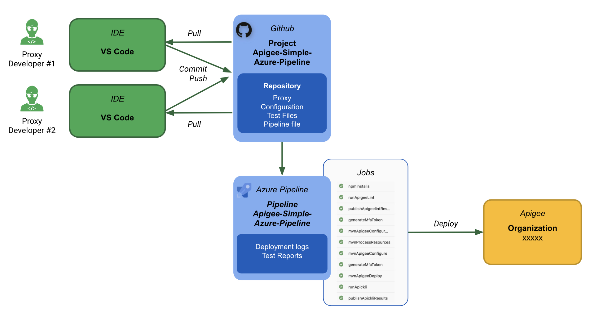

# Apigee: Simple Azure Pipeline: work in progress
## Goal

Simple implementation of a CI/CD pipeline for Apigee using
[Azure Pipeline](https://docs.microsoft.com/en-us/azure/devops/pipelines/get-started/what-is-azure-pipelines?view=azure-devops) and the [Apigee Deploy Maven Plugin](https://github.com/apigee/apigee-deploy-maven-plugin).

The CICD pipeline includes:

- Static code analysis for Apigee proxy and sharedflow using [apigeelint](https://github.com/apigee/apigeelint)
- Integration testing of the deployed proxy using
  [apickli](https://github.com/apickli/apickli)
- Deployment of the API proxy configuration using
  [Apigee Config Maven Plugin](https://github.com/apigee/apigee-config-maven-plugin)
- Packaging and deployment of the API proxy bundle using
  [Apigee Deploy Maven Plugin](https://github.com/apigee/apigee-deploy-maven-plugin)

